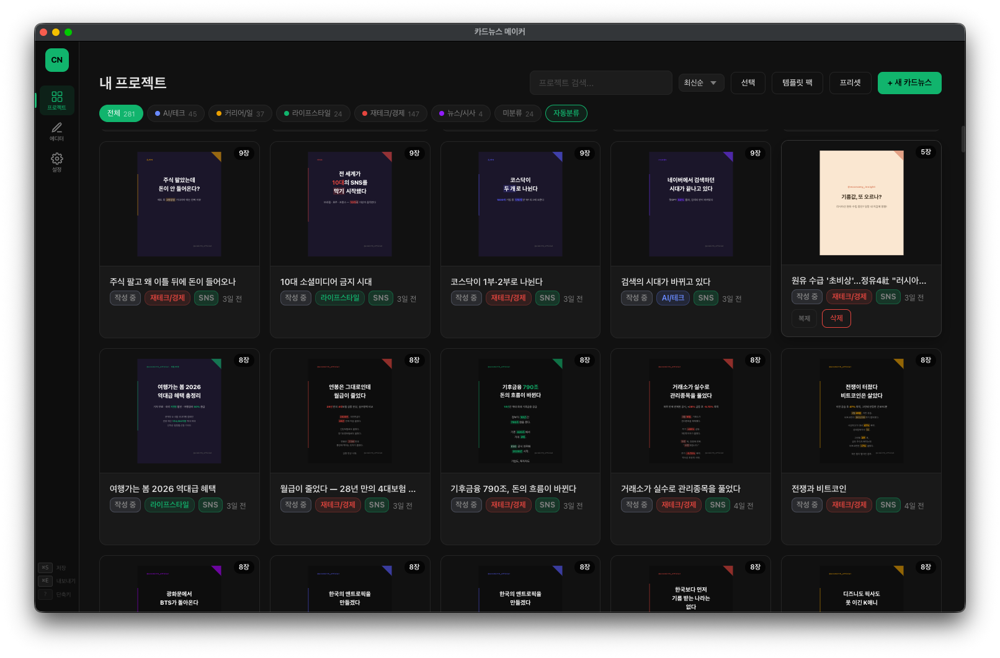
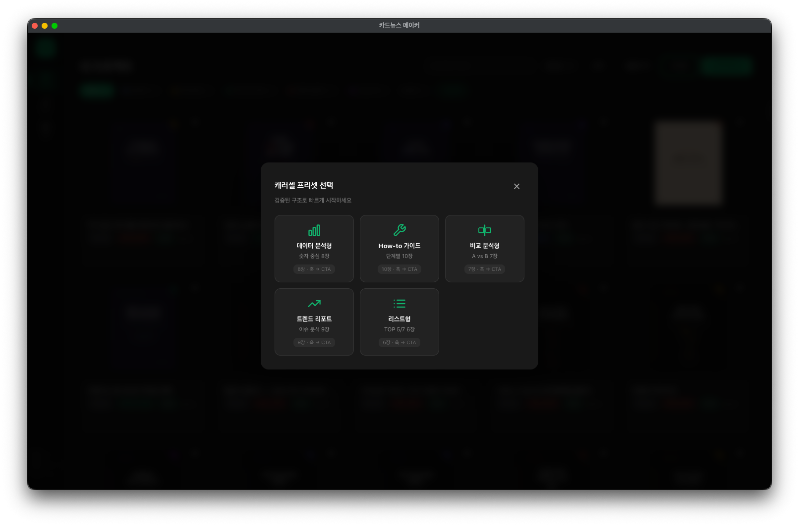
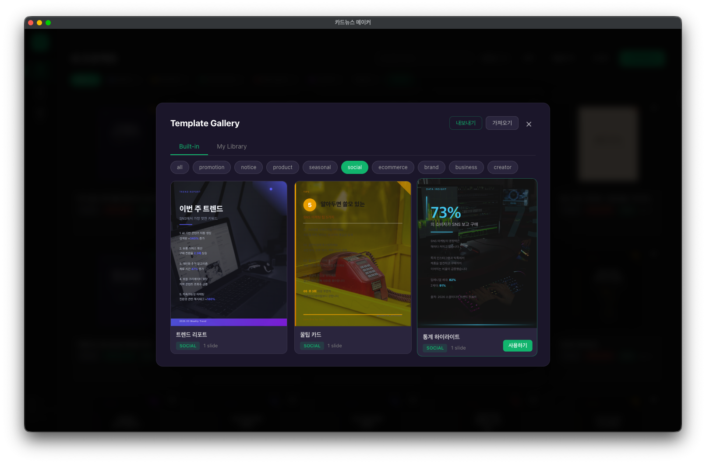
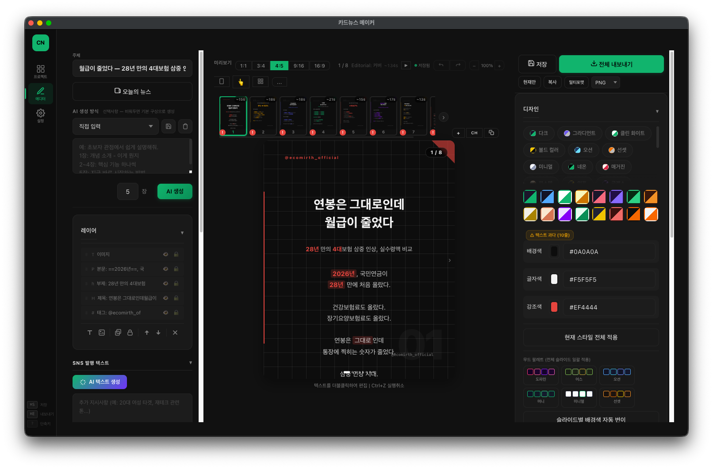
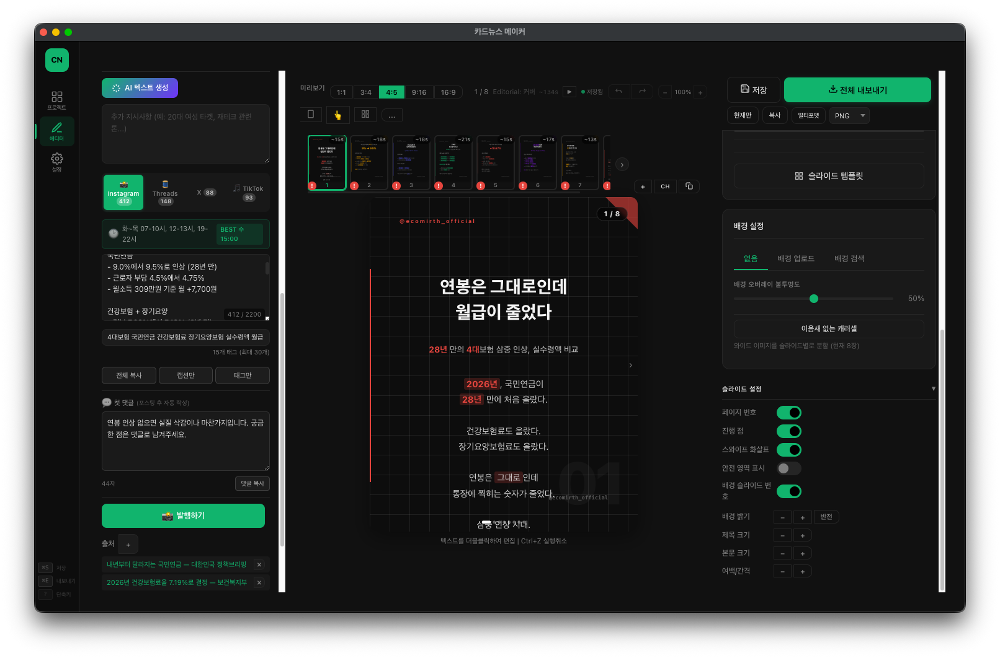
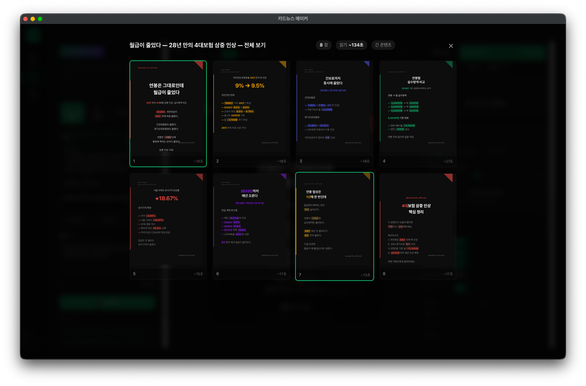
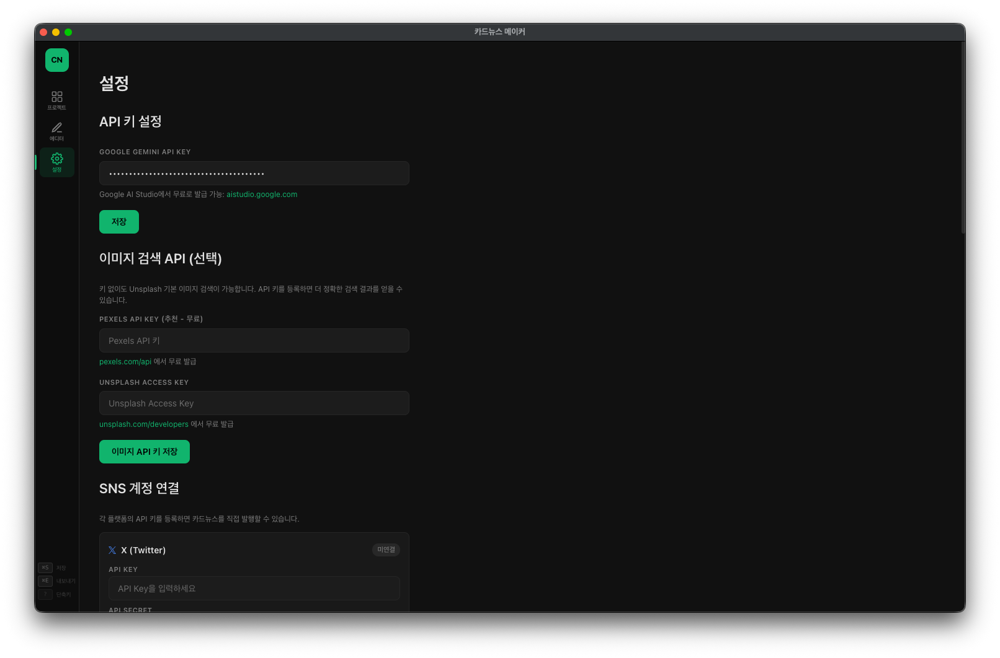

# Card News Maker

AI 기반 SNS 카드뉴스 제작 데스크톱 앱

> Instagram, TikTok, Threads, X(Twitter)용 캐러셀 카드뉴스를 AI로 빠르게 만들고 바로 발행하세요.

---

## Download

- [macOS (Apple Silicon) DMG 다운로드](https://github.com/lnto3408/card-news-maker/releases/latest/download/Card.News.Maker-1.0.0-arm64.dmg)
- Version: 1.0.0
- Size: ~549MB

---

## Features

### 1. Project Management (프로젝트 관리)

- 전체 프로젝트를 그리드 형태로 관리
- 카테고리별 자동 분류: AI/테크, 커리어/일, 라이프스타일, 재테크/경제, 뉴스/시사
- **자동분류** 버튼으로 AI가 주제를 분석하여 카테고리 자동 지정
- 프로젝트 검색, 정렬 (최신순/오래된순/이름순)
- 복제, 삭제, 일괄 선택 지원
- 각 프로젝트 카드에 썸네일, 슬라이드 수, 작성 상태, SNS 발행 여부 표시

---

### 2. Carousel Preset (캐러셀 프리셋)

새 카드뉴스 생성 시 검증된 구조로 빠르게 시작할 수 있는 5가지 프리셋 제공:

| 프리셋 | 설명 | 슬라이드 구성 |
|--------|------|--------------|
| 데이터 분석형 | 숫자 중심 콘텐츠 | 8장: 훅 -> CTA |
| How-to 가이드 | 단계별 설명 | 10장: 훅 -> CTA |
| 비교 분석형 | A vs B 비교 | 7장: 훅 -> CTA |
| 트렌드 리포트 | 이슈 분석 | 9장: 훅 -> CTA |
| 리스트형 | TOP 5/7 리스트 | 6장: 훅 -> CTA |

---

### 3. Template Gallery (템플릿 갤러리)

- **40+ 빌트인 템플릿**: promotion, notice, product, seasonal, social, ecommerce, brand, business, creator 카테고리
- 봄맞이 세일, 설 연휴 배송 안내, 할인 쿠폰, Flash Sale, 공지사항 등 실전 템플릿
- Built-in / My Library 탭으로 구분
- 내보내기/가져오기로 템플릿 공유 가능
- "사용하기" 버튼 클릭으로 즉시 적용

---

### 4. Editor - Layer System (에디터 - 레이어 시스템)

3단 레이아웃의 메인 에디터:

**왼쪽 패널**
- 주제 입력 및 AI 콘텐츠 생성
- "오늘의 뉴스" - Google News RSS 연동으로 실시간 뉴스 가져오기
- AI 생성 방식 선택 (직접 입력 / 프롬프트 템플릿)
- 슬라이드 수 지정 (1~10장)
- 레이어 관리: 태그, 제목, 부제, 본문, 이미지 레이어
- 레이어 순서 변경, 복제, 잠금, 표시/숨기기

**중앙 캔버스**
- 라이브 프리뷰 (1:1, 3:4, 4:5, 9:16, 16:9 비율)
- 슬라이드 썸네일 스트립으로 전체 슬라이드 탐색
- 드래그로 레이어 위치 이동, 코너 핸들로 크기 조절
- 더블클릭 인라인 텍스트 편집
- 페이지 번호, 진행 점, 스와이프 화살표 표시

**오른쪽 패널**
- 슬라이드 템플릿 적용
- 배경 설정: 없음 / 업로드 / 검색 (Unsplash, Pexels)
- 배경 오버레이 투명도 조절 (0~100%)
- 슬라이드별 설정: 페이지 번호, 진행 점, 스와이프 화살표, 안전 영역 표시
- Quick Edit: 배경 밝기(+/-), 반전, 제목/본문 크기, 여백/간격

---

### 5. Editor - Design & Color (에디터 - 디자인 & 컬러)

**12가지 디자인 템플릿**
- 다크 / 그라디언트 / 클린 화이트
- 볼드 컬러 / 오션 / 선셋
- 미니멀 / 네온 / 매거진

**14가지 컬러 프리셋**
- 배경색, 글자색, 강조색을 HEX 값으로 직접 지정 가능
- "현재 스타일 전체 적용" 버튼으로 모든 슬라이드에 일괄 적용

**무드 팔레트 (전체 슬라이드 일괄 적용)**
- 도파민 / 어스 / 오션 / 민트 / 미니멀 / 선셋 등 6가지 무드
- "슬라이드별 배경색 자동 변이" 기능

---

### 6. SNS Publishing (SNS 발행)

- **4개 플랫폼 동시 지원**: Instagram, Threads, X(Twitter), TikTok
- 플랫폼별 글자 수 표시 (Instagram 2200자, Threads 500자 등)
- **AI 텍스트 생성**: 캡션, 해시태그를 플랫폼 특성에 맞게 자동 생성
- 캡션만 / 태그만 복사 버튼
- **첫 댓글** 자동 작성 (포스팅 후 자동 게시)
- 최적 발행 시간 표시 (화~목 07-10시, 12-13시, 19-22시 / BEST 수 15:00)
- "발행하기" 버튼으로 원클릭 게시
- **출처 관리**: 참고 기사 URL 추가/삭제

---

### 7. Overview Mode (전체 보기)

- 프로젝트의 모든 슬라이드를 한 화면에서 확인
- 슬라이드별 예상 읽기 시간 표시 (~15초, ~21초 등)
- 전체 읽기 시간 합산 표시 (예: 읽기 ~134초)
- "긴 콘텐츠" 경고 표시
- 슬라이드 수 확인

---

### 8. Settings (설정)

**API 키 설정**
- Google Gemini API Key (AI 콘텐츠 생성용)
- Google AI Studio에서 무료 발급 가능

**이미지 검색 API (선택)**
- Pexels API Key (무료)
- Unsplash Access Key (무료)
- 키 없이도 기본 이미지 검색 가능

**SNS 계정 연결**
- X (Twitter): API Key, API Secret, Access Token, Access Secret
- Instagram, Threads, TikTok 계정 연동

---

## System Requirements

| 항목 | 요구사항 |
|------|---------|
| OS | macOS (Apple Silicon / M1 이상) |
| 디스크 | ~600MB 이상 여유 공간 |
| 네트워크 | AI 생성, 이미지 검색, SNS 발행 시 인터넷 필요 |
| API Key | Google Gemini API Key (필수, 무료 발급) |

---

## Limitations (제약사항)

### Platform
- **macOS Apple Silicon 전용**: Intel Mac 및 Windows/Linux는 현재 미지원
- **코드 서명 미포함**: 처음 실행 시 macOS Gatekeeper 경고가 표시됩니다
  - `시스템 설정 > 개인정보 보호 및 보안 > 확인 없이 열기`에서 허용 필요
  - 또는 터미널에서 `xattr -cr "/Applications/Card News Maker.app"` 실행

### AI Generation
- Google Gemini API Key가 필수 (무료 티어 사용 가능)
- AI 생성 품질은 입력 프롬프트와 주제에 따라 달라질 수 있음
- API 호출 제한: Google AI Studio 무료 티어 기준 분당 15회, 일 1,500회

### SNS Publishing
- SNS 발행은 각 플랫폼의 API 키/토큰이 별도로 필요
- Instagram/Threads는 Meta Developer 앱 등록 필요
- 각 플랫폼의 API 정책 변경에 따라 발행 기능이 제한될 수 있음
- 자동 발행 시 플랫폼별 스팸 필터에 의해 일시 차단될 수 있음

### Image & Export
- 이미지 내보내기는 PNG 포맷만 지원 (PDF, JPG 미지원)
- 배경 이미지 검색은 Unsplash/Pexels API에 의존 (API 키 없이도 기본 검색 가능)
- 한 프로젝트당 최대 10장 슬라이드

### Data
- 프로젝트 데이터는 로컬에만 저장 (클라우드 동기화 없음)
- 앱 삭제 시 프로젝트 데이터도 함께 삭제됨

---

## Tech Stack

| Component | Technology |
|-----------|-----------|
| Framework | Electron 33 |
| AI | Google Gemini 2.0 Flash (@google/generative-ai) |
| Image Capture | html2canvas 1.4 |
| News Feed | Google News RSS |
| Image Search | Unsplash / Pexels |
| Data Storage | Local JSON (Electron userData) |

---

## License

Personal use only.

---

## Contact

- Threads: [@ecomirth_official](https://www.threads.net/@ecomirth_official)
- Instagram: [@ecomirth_official](https://www.instagram.com/ecomirth_official)
- TikTok: [@ecomirth_official](https://www.tiktok.com/@ecomirth_official)
